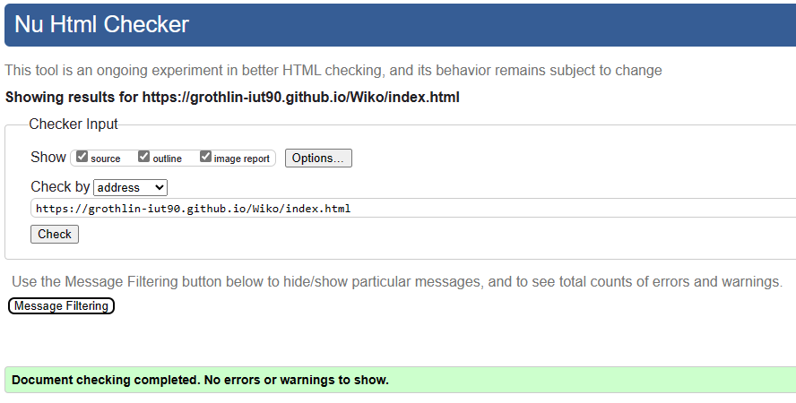

# Titre sujet   

## Sujet    

[Wiko](https://grothlin-iut90.github.io/Wiko/)

## Membres du groupe :

-Etudiant 1 (référent du groupe) : [RÖTHLIN Gaël](mailto:gael.rothlin@edu.univ-fcomte.fr?subject=SAE_1_05_06)  
-Etudiant 2 : [SOLTNER Audrick](mailto:audrick.soltner@edu.univ-fcomte.fr?subject=SAE_1_05_06)   
-Etudiant 3 : [MERVAL Mattéo](mailto:matteo.merval@edu.univ-fcomte.fr?subject=SAE_1_05_06)  
-Etudiant 4 : [ZIEGLER Teddy](mailto:teddy.ziegler@edu.univ-fcomte.fr?subject=SAE_1_05_06) 

## Présentation 

Ce dépôt correspond à un site web créé en HTML/CSS/JS dans le cadre de la SAÉ 05-06 à l'IUT de Belfort-Montbéliard. Ce site présente des informations concernant l'entreprise Wiko et sert de vitrine pour présenter l'entreprise, ses activité, son organisation et son historique. Vous trouverez dans ce dépôt et sur le site un <a href="rapport_économique.pdf" download>rapport économique</a>analysant l'aspect économique de Wiko. 
Ce site comporte 5 pages dont un menu et quatre articles présentant des aspects différents de l'entreprise qui sont les suivant:
- Le menu (RÖTHLIN Gaël, SOLTNER Audrick)
- L’histoire de l’entreprise (RÖTHLIN Gaël)
- Les produits et services vendus (MERVAL Mattéo)
- Une analyse économique (ZIEGLER Teddy) 
- Les incidents et controverses(SOLTNER Audrick)

## Choix de conception  

Pour la conception du site, nous nous sommes grandement inspirés des sites officiels [Crustac](http://crustac.fr), [Adveris](https://www.adveris.fr/) ainsi que du site [Dreamingwithjeff](http://www.dreamingwithjeff.com).

## Développement Site Web et Validation des pages

### Page d'accueil

**Auteur : SOLTNER Audrick et RÖTHLIN Gaël** 

Vérification W3C : [Détail ICI](https://validator.w3.org/nu/?showsource=yes&showoutline=yes&showimagereport=yes&doc=https%3A%2F%2Fgrothlin-iut90.github.io%2FWiko%2FAudrick_S%2Fpage.html)

### Histoire de l'entreprise

**Auteur : RÖTHLIN Gaël**  

Verification W3C : [Détail ICI](https://validator.w3.org/nu/?showsource=yes&showoutline=yes&showimagereport=yes&doc=https%3A%2F%2Fgrothlin-iut90.github.io%2FWiko%2FGa%25C3%25ABl_R%2FPage1.html)

 

<!--  style="width=400px" ne fonctionne pas -->

### Produits et services

**Auteur : MERVAL Mattéo**  

Verification W3C : [Détail ICI](https://validator.w3.org/nu/?showsource=yes&showoutline=yes&showimagereport=yes&doc=https%3A%2F%2Fgrothlin-iut90.github.io%2FWiko%2FMatt%25C3%25A9o_M%2FPage1.html)

 

### Présentation générale

**Auteur : ZIEGLER Teddy**  

Verification W3C : [Détail ICI](https://validator.w3.org/nu/?showsource=yes&showoutline=yes&showimagereport=yes&doc=https%3A%2F%2Fgrothlin-iut90.github.io%2FWiko%2FTeddy_Z%2Fpageteddy.html)

 

### Présentation des incidents et controverses

**Auteur : SOLTNER Audrick**  

Verification W3C : [Détail ICI](https://validator.w3.org/nu/?doc=https%3A%2F%2Fgrothlin-iut90.github.io%2FWiko%2FAudrick_S%2Fpage.html)

 

## Répartition du travail

### Planification - Diagramme de GANTT

- MERVAL Mattéo

### Recherches d'informations

- RÖTHLIN Gaël
- MERVAL Mattéo
- ZIEGLER Teddy
- SOLTNER Audrick

### Rapport économique

- RÖTHLIN Gaël
- MERVAL Mattéo
- ZIEGLER Teddy
- SOLTNER Audrick

### Développement site

- RÖTHLIN Gaël
  - Menu et "Template" de page (Navbar/Footer)
  - Page histoire
- MERVAL Mattéo
  - Page produit
- ZIEGLER Teddy
  - Page économie 
- SOLTNER Audrick
  - Menu   
  - Page incidents
